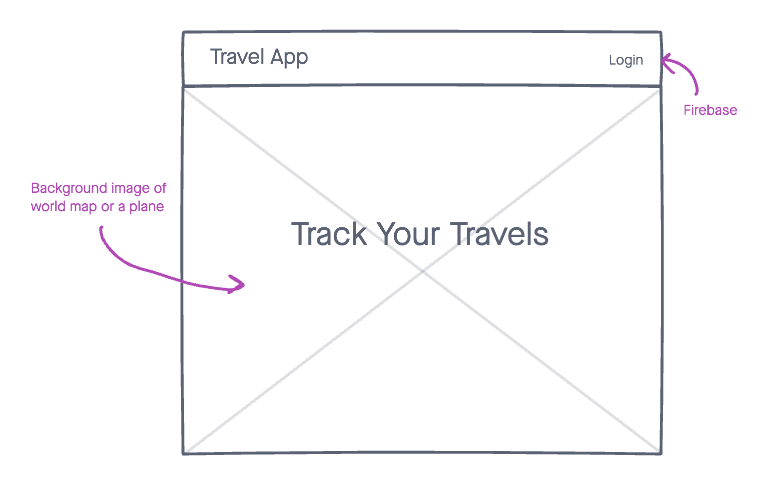
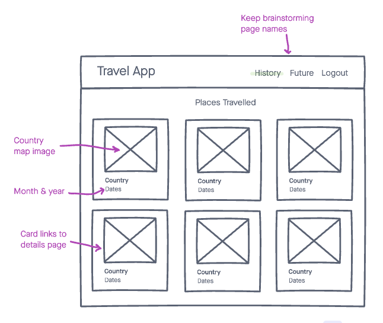
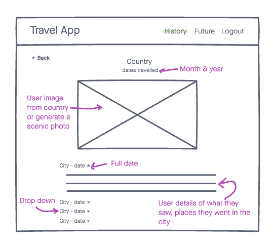

# Travel Tracker App
This SPA was created for a user to save a list of countries they've visited and list countries they want to visit in the future. 

## Technologies Used
* JSX
* CSS
* JavaScript
* React
    * Hooks - useState, useEffect
    * Context API
* Express
* NodeJS
* MongoDB
* Mongoose
* Google Firebase
* Unsplash API
* Restcountries API

## Features
* Log in and out with Google account
* Track a list of countries that the user has visited and a separate list of countries they want to visit
* Within each country, the user can list cities they've visited or want to visit
* In each city, the user can add information about their trip
* The countries, cities, and details have full CRUD capability

## Wireframes

## Screenshots

## Future Goals
* Allow the user to upload personal photos
* Fine tune styling with custom fonts, more sophisticated layout
* Fix bug that breaks app when user refreshes page